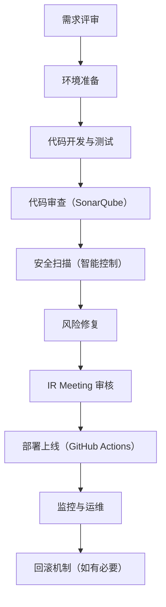

```mermaid
graph TD
  A[需求评审] --> B[环境准备]
  B --> C[代码开发与测试]
  C --> D[代码审查（SonarQube）]
  D --> E[安全扫描（智能控制）]
  E --> F[风险修复]
  F --> G[IR Meeting 审核]
  G --> H[部署上线（GitHub Actions）]
  H --> I[监控与运维]
  I --> J[回滚机制（如有必要）]
```