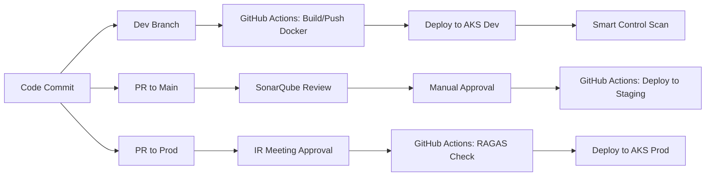

```mermaid
flowchart LR  
    A[Code Commit] --> B[Dev Branch]  
    B --> C1[GitHub Actions: Build/Push Docker]  
    C1 --> D1[Deploy to AKS Dev]  
    D1 --> E[Smart Control Scan]  

    A --> F[PR to Main]  
    F --> G[SonarQube Review]  
    G --> H[Manual Approval]  
    H --> C2[GitHub Actions: Deploy to Staging]  

    A --> I[PR to Prod]  
    I --> J[IR Meeting Approval]  
    J --> C3[GitHub Actions: RAGAS Check]  
    C3 --> K[Deploy to AKS Prod]  
```