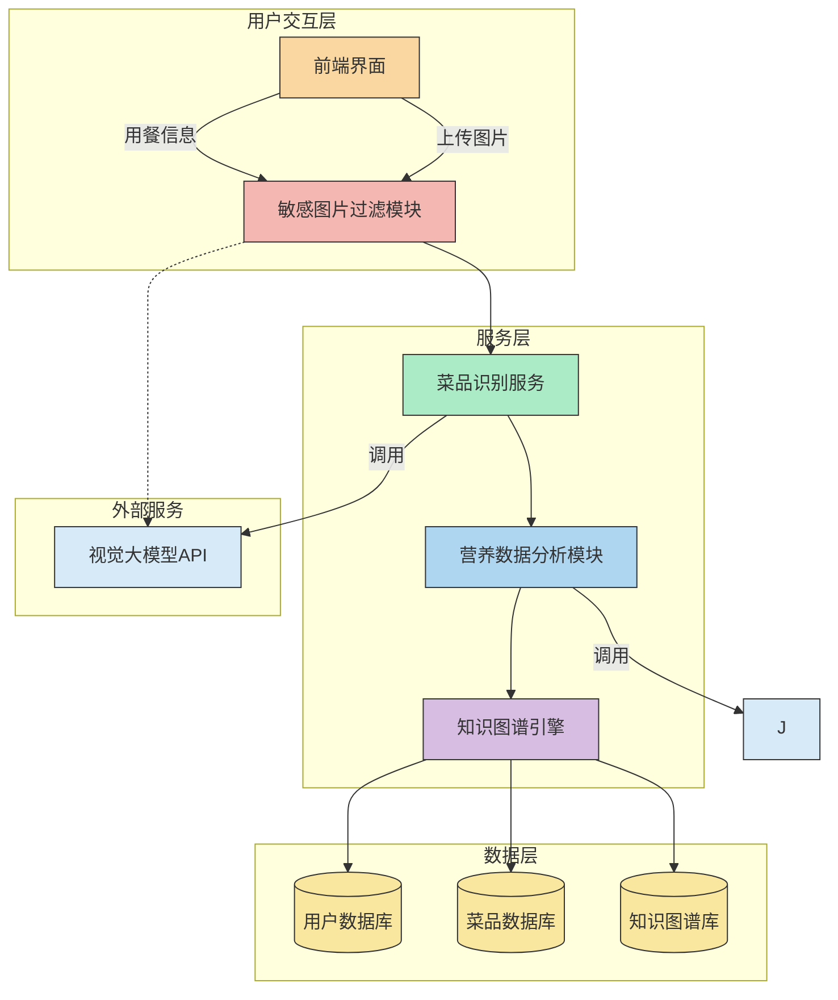

```mermaid
%% 系统架构图（基于网页1/3/4/6的流程图语法优化）
flowchart TD
    subgraph 用户交互层
        A[前端界面] -->|用餐信息| B[敏感图片过滤模块]
        style A fill:#FAD7A0,stroke:#333
        style B fill:#F5B7B1,stroke:#333
    end

    subgraph 服务层
        B --> C[菜品识别服务]
        C --> D[营养数据分析模块]
        D --> E[知识图谱引擎]
        style C fill:#ABEBC6,stroke:#333
        style D fill:#AED6F1,stroke:#333
        style E fill:#D7BDE2,stroke:#333
    end

    subgraph 数据层
        E --> F[(用户数据库)]
        E --> G[(菜品数据库)]
        E --> H[(知识图谱库)]
        style F fill:#F9E79F,stroke:#333,shape:cylinder
        style G fill:#F9E79F,stroke:#333,shape:cylinder
        style H fill:#F9E79F,stroke:#333,shape:cylinder
    end

    subgraph 外部服务
        B -.-> I[视觉大模型API]

        style I fill:#D6EAF8,stroke:#333
        style J fill:#D6EAF8,stroke:#333
    end


    A -->|上传图片| B
    C -->|调用| I
    D -->|调用| J
```