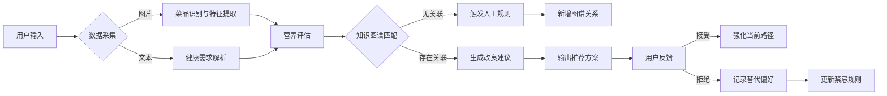

```mermaid
%% 流程图（基于网页4/5/7的过程优化）
flowchart LR
    A[用户输入] --> B{数据采集}
    B -->|图片| C[菜品识别与特征提取]
    B -->|文本| D[健康需求解析]
    C --> E[营养评估]
    D --> E
    E --> F{知识图谱匹配}
    F -->|存在关联| G[生成改良建议]
    F -->|无关联| H[触发人工规则]
    H --> I[新增图谱关系]
    G --> J[输出推荐方案]
    J --> K[用户反馈]
    K -->|接受| L[强化当前路径]
    K -->|拒绝| M[记录替代偏好]
    M --> N[更新禁忌规则]
```