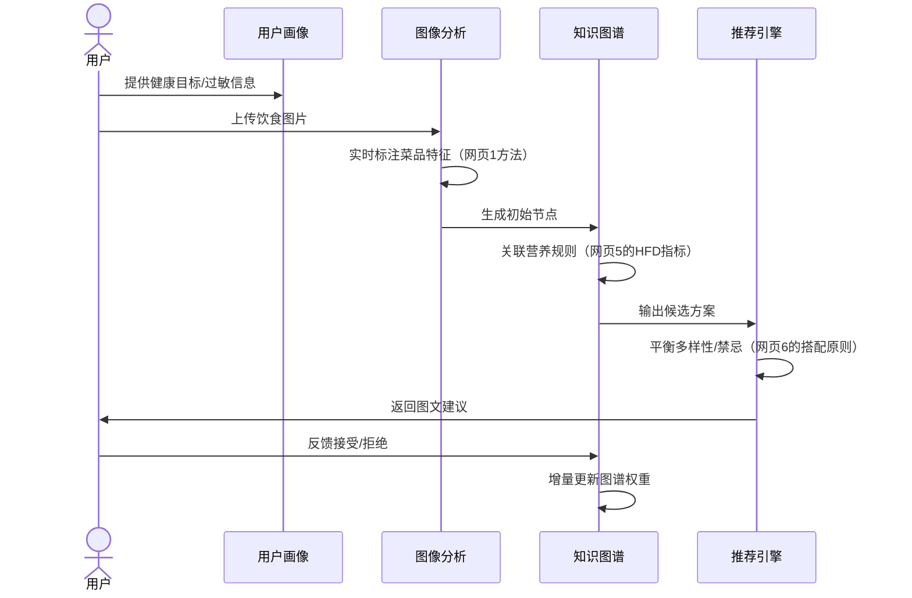

```mermaid
%% 数据流图（基于网页1/2/5的时序图语法优化）
sequenceDiagram
    actor User as 用户
    participant UP as 用户画像
    participant IA as 图像分析
    participant KG as 知识图谱
    participant RM as 推荐引擎

    User->>UP: 提供健康目标/过敏信息
    User->>IA: 上传饮食图片
    IA->>IA: 实时标注菜品特征（网页1方法）
    IA->>KG: 生成初始节点
    KG->>KG: 关联营养规则（网页5的HFD指标）
    KG->>RM: 输出候选方案
    RM->>RM: 平衡多样性/禁忌（网页6的搭配原则）
    RM->>User: 返回图文建议
    User->>KG: 反馈接受/拒绝
    KG->>KG: 增量更新图谱权重
```