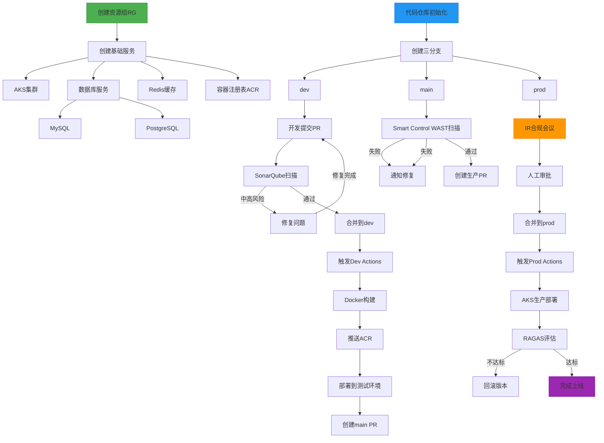

```mermaid
graph TD
    A[创建资源组RG] --> B[创建基础服务]
    B --> C[AKS集群]
    B --> D[数据库服务]
    D --> DA[MySQL]
    D --> DB[PostgreSQL]
    B --> E[Redis缓存]
    B --> F[容器注册表ACR]
    
    G[代码仓库初始化] --> H[创建三分支]
    H --> I[dev]
    H --> J[main]
    H --> K[prod]
    K --> W[IR合规会议]
    J --> T[Smart Control WAST扫描]
    
    T -->|失败| U[通知修复]
    I --> L[开发提交PR]
    L --> M[SonarQube扫描]
    M -->|中高风险| N[修复问题]
    N -->|修复完成|L
    M -->|通过| O[合并到dev]
    
    O --> P[触发Dev Actions]
    P --> Q[Docker构建]
    Q --> R[推送ACR]
    R --> S[部署到测试环境]
    S --> SA[创建main PR]
    %% S -->V[创建生产PR]

    
    %% S --> T[Smart Control WAST扫描]
    T -->|失败| U[通知修复]

    
    T -->|通过| V[创建生产PR]

    
    %% V --> W[IR合规会议]
    W --> X[人工审批]
    X --> Y[合并到prod]
    
    Y --> Z[触发Prod Actions]
    Z --> AC[AKS生产部署]
    %% Z --> AA[安全扫描]
    %% AA -->|高风险| AB[终止部署]
    %% AA -->|通过| AC[AKS生产部署]
    
    AC --> AD[RAGAS评估]
    AD -->|不达标| AE[回滚版本]
    AD -->|达标| AF[完成上线]
    
    style A fill:#4CAF50,stroke:#388E3C
    style G fill:#2196F3,stroke:#1976D2
    style W fill:#FF9800,stroke:#F57C00
    style AF fill:#9C27B0,stroke:#7B1FA2
```