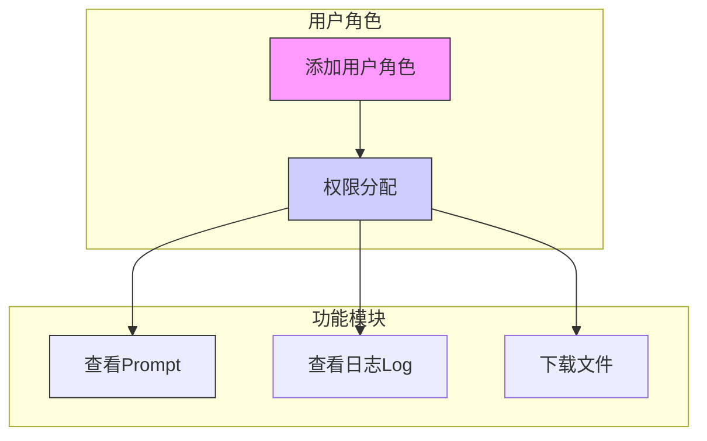

```mermaid
flowchart TD
    subgraph 用户角色
        A[添加用户角色] --> B[权限分配]
    end

    subgraph 功能模块
        B --> C[查看Prompt]
        B --> D[查看日志Log]
        B --> E[下载文件]
    end

    style A fill:#f9f,stroke:#333
    style B fill:#ccf,stroke:#333
    style C D fill:#9f9,stroke:#333
```