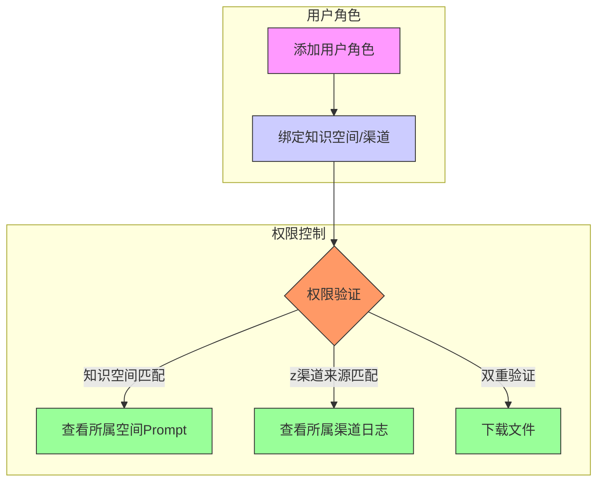

```mermaid
flowchart TD
    subgraph 用户角色
        A[添加用户角色] --> B[绑定知识空间/渠道]
    end

    subgraph 权限控制
        B --> F{权限验证}
        F -->|知识空间匹配| C[查看所属空间Prompt]
        F -->|z渠道来源匹配| D[查看所属渠道日志]
        F -->|双重验证| E[下载文件]
    end

    style A fill:#f9f,stroke:#333
    style B fill:#ccf,stroke:#333
    style F fill:#f96,stroke:#333
    style C fill:#9f9,stroke:#333
    style D fill:#9f9,stroke:#333
    style E fill:#9f9,stroke:#333
```