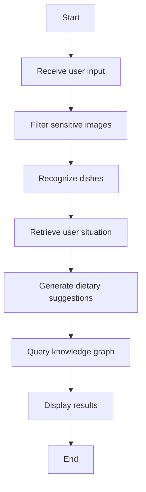

```mermaid
graph TB
    Start --> ReceiveInput
    ReceiveInput --> FilterSensitiveImages
    FilterSensitiveImages --> RecognizeDishes
    RecognizeDishes --> RetrieveUserSituation
    RetrieveUserSituation --> GenerateDietarySuggestions
    GenerateDietarySuggestions --> QueryKnowledgeGraph
    QueryKnowledgeGraph --> DisplayResults
    DisplayResults --> End

    ReceiveInput[ Receive user input ]
    FilterSensitiveImages[ Filter sensitive images ]
    RecognizeDishes[ Recognize dishes ]
    RetrieveUserSituation[ Retrieve user situation ]
    GenerateDietarySuggestions[ Generate dietary suggestions ]
    QueryKnowledgeGraph[ Query knowledge graph ]
    DisplayResults[ Display results ]
```