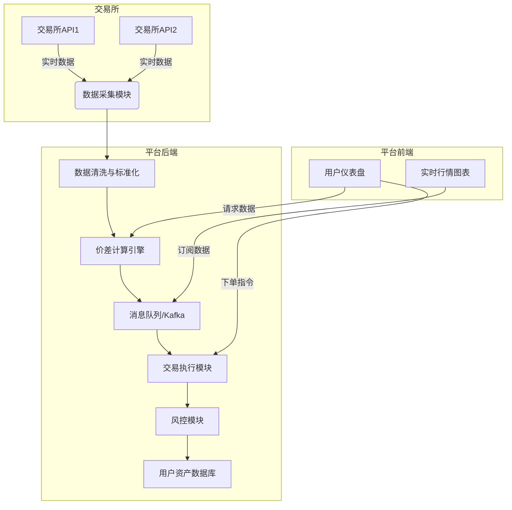

```mermaid
graph TD
    subgraph 交易所
        A[交易所API1] -->|实时数据| B(数据采集模块)
        C[交易所API2] -->|实时数据| B
    end
    subgraph 平台后端
        B --> D[数据清洗与标准化]
        D --> E[价差计算引擎]
        E --> F[消息队列/Kafka]
        F --> G[交易执行模块]
        G --> H[风控模块]
        H --> I[用户资产数据库]
    end
    subgraph 平台前端
        J[用户仪表盘] -->|请求数据| E
        J -->|下单指令| G
        K[实时行情图表] -->|订阅数据| F
    end
```