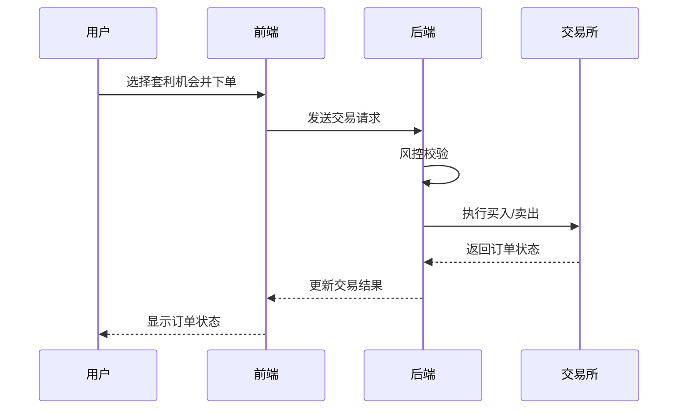

```mermaid
sequenceDiagram
    participant 用户
    participant 前端
    participant 后端
    participant 交易所
    用户->>前端: 选择套利机会并下单
    前端->>后端: 发送交易请求
    后端->>后端: 风控校验
    后端->>交易所: 执行买入/卖出
    交易所-->>后端: 返回订单状态
    后端-->>前端: 更新交易结果
    前端-->>用户: 显示订单状态
```