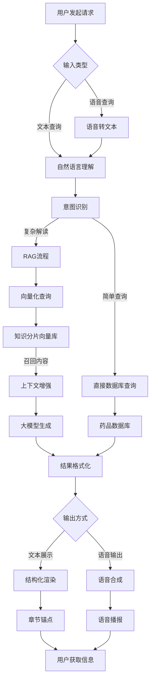

```mermaid
%% 流程图
flowchart TD
    Start[用户发起请求] --> InputType{输入类型}
    InputType -->|语音查询| ASR[语音转文本]
    InputType -->|文本查询| NLU[自然语言理解]
    
    ASR --> NLU
    NLU --> Intent[意图识别]
    
    Intent -->|简单查询| Search[直接数据库查询]
    Intent -->|复杂解读| RAG[RAG流程]
    
    Search --> K[药品数据库]
    RAG --> Embedding[向量化查询]
    Embedding --> P[知识分片向量库]
    
    P -->|召回内容| Augment[上下文增强]
    Augment --> Q[大模型生成]
    
    Q --> Format[结果格式化]
    K --> Format
    
    Format --> OutputType{输出方式}
    OutputType -->|文本展示| Render[结构化渲染]
    OutputType -->|语音输出| TTS[语音合成]
    
    Render --> D[章节锚点]
    TTS --> Play[语音播报]
    
    D --> End[用户获取信息]
    Play --> End
```