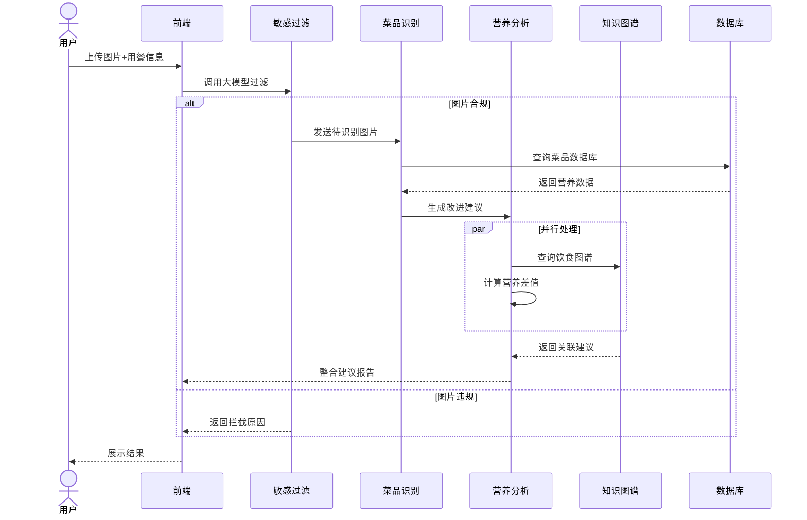

```mermaid

sequenceDiagram
    actor User as 用户
    participant FE as 前端
    participant SF as 敏感过滤
    participant DR as 菜品识别
    participant NA as 营养分析
    participant KG as 知识图谱
    participant DB as 数据库

    User->>FE: 上传图片+用餐信息
    FE->>SF: 调用大模型过滤
    alt 图片合规
        SF->>DR: 发送待识别图片
        DR->>DB: 查询菜品数据库
        DB-->>DR: 返回营养数据
        DR->>NA: 生成改进建议
        par 并行处理
            NA->>KG: 查询饮食图谱
            NA->>NA: 计算营养差值
        end
        KG-->>NA: 返回关联建议
        NA-->>FE: 整合建议报告
    else 图片违规
        SF-->>FE: 返回拦截原因
    end
    FE-->>User: 展示结果
```