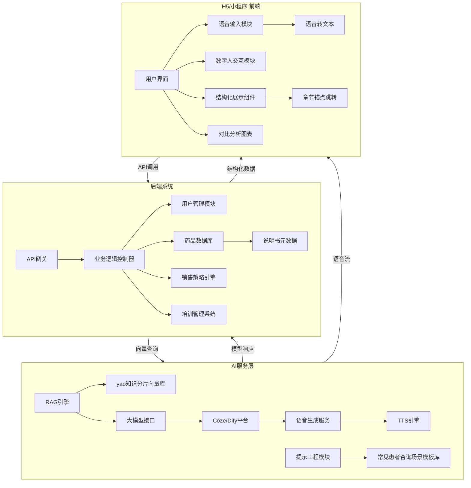

```mermaid
%% 结构图
graph TD
    subgraph AI[AI服务层]
        O[RAG引擎] --> P[yao知识分片向量库]
        O --> Q[大模型接口]
        Q --> R[Coze/Dify平台]
        R --> S
        S[语音生成服务] --> T[TTS引擎]
        U[提示工程模块] --> V[常见患者咨询场景模板库]
    end


    subgraph Backend[后端系统]
        H[API网关] --> I[业务逻辑控制器]
        I --> J[用户管理模块]
        I --> K[药品数据库]
        I --> L[销售策略引擎]
        I --> M[培训管理系统]
        K --> N[说明书元数据]
    end

    subgraph Frontend[H5/小程序 前端]
        A[用户界面] --> B[语音输入模块]
        A --> C[数字人交互模块]
        A --> D[结构化展示组件]
        A --> E[对比分析图表]
        B --> F[语音转文本]
        D --> G[章节锚点跳转]
    end


    Frontend -->|API调用| Backend
    Backend -->|向量查询| AI
    AI -->|模型响应| Backend
    Backend -->|结构化数据| Frontend
    AI -->|语音流| Frontend
```